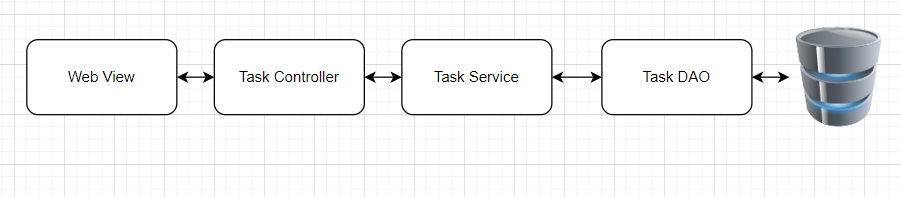
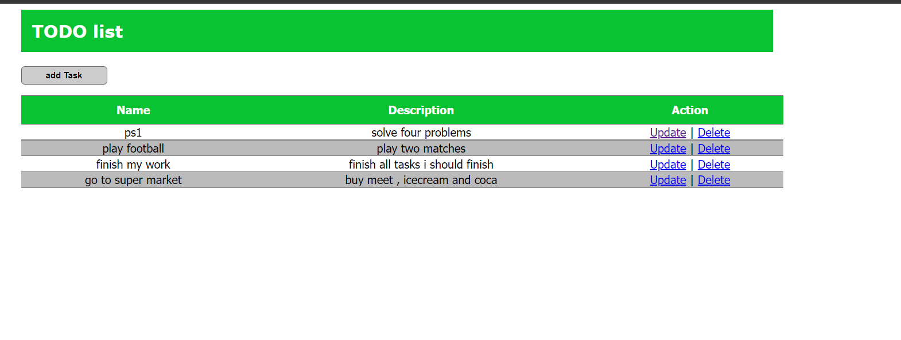
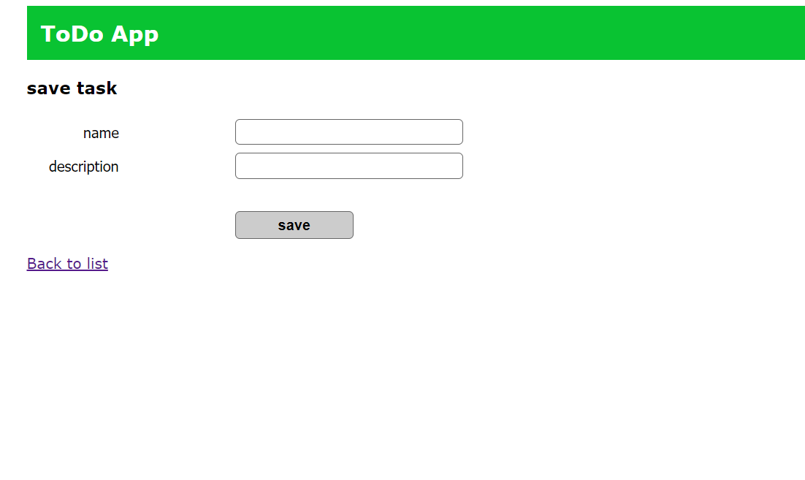
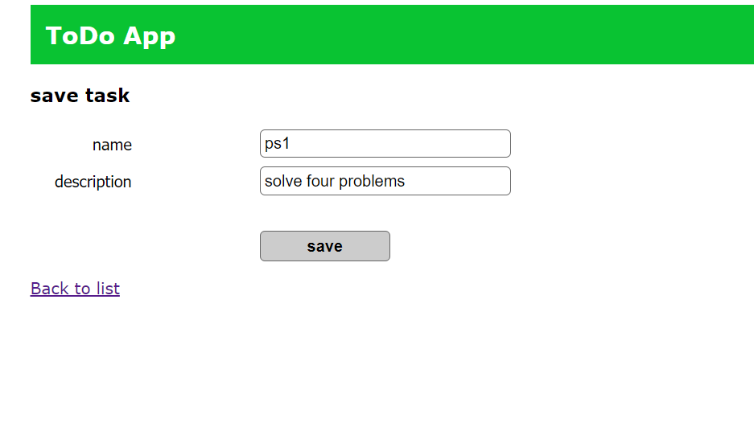
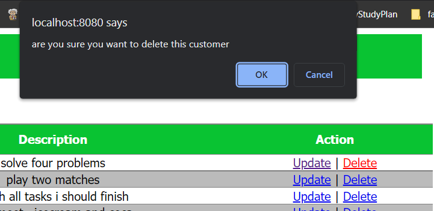

# Todo List App

### tools
- Spring
- hibernate
- MySQL
- JSP & JSTL

## database schema
```mysql
CREATE DATABASE todo_java_mvc;
USE todo_java_mvc;

CREATE TABLE `task` (
  `id` int(11) NOT NULL AUTO_INCREMENT,
  `name` varchar(45) DEFAULT NULL,
  `description` varchar(255) DEFAULT NULL,
  PRIMARY KEY (`id`)
) ENGINE=InnoDB AUTO_INCREMENT=6 DEFAULT CHARSET=latin1;
/*!40101 SET character_set_client = @saved_cs_client */;
```


## Architecture



## project pages
### view tasks


### add task


### update task


### delete task
confirmation massage before delete
;


## dependencies

```xml
  <dependencies>
    
     <!-- https://mvnrepository.com/artifact/javax.servlet/javax.servlet-api -->
        <dependency>
          <groupId>javax.servlet</groupId>
          <artifactId>javax.servlet-api</artifactId>
          <version>4.0.1</version>
          <scope>provided</scope>
        </dependency>
    
        <!-- https://mvnrepository.com/artifact/javax.servlet/servlet-api -->
        <dependency>
          <groupId>javax.servlet</groupId>
          <artifactId>servlet-api</artifactId>
          <version>2.5</version>
          <scope>provided</scope>
        </dependency>
        <!-- https://mvnrepository.com/artifact/org.hibernate/hibernate-validator -->
        <!-- https://mvnrepository.com/artifact/javax.validation/validation-api -->
        <dependency>
          <groupId>javax.validation</groupId>
          <artifactId>validation-api</artifactId>
          <version>2.0.1.Final</version>
        </dependency>
    
    
        <dependency>
          <groupId>org.projectlombok</groupId>
          <artifactId>lombok</artifactId>
          <version>1.18.24</version>
        </dependency>
    
    
        <dependency>
          <groupId>javax.servlet</groupId>
          <artifactId>jstl</artifactId>
          <version>1.2</version>
        </dependency>
    
        <!-- https://mvnrepository.com/artifact/com.mchange/c3p0 -->
        <dependency>
          <groupId>com.mchange</groupId>
          <artifactId>c3p0</artifactId>
          <version>0.9.5.5</version>
        </dependency>
    
        <!-- Spring -->
        <dependency>
          <groupId>org.springframework</groupId>
          <artifactId>spring-core</artifactId>
          <version>5.3.23</version>
        </dependency>
        <!-- https://mvnrepository.com/artifact/org.springframework/spring-webmvc -->
        <dependency>
          <groupId>org.springframework</groupId>
          <artifactId>spring-webmvc</artifactId>
          <version>5.3.23</version>
        </dependency>
    
        <dependency>
          <groupId>org.springframework</groupId>
          <artifactId>spring-context</artifactId>
          <version>5.3.23</version>
        </dependency>
    
        <dependency>
          <groupId>org.springframework</groupId>
          <artifactId>spring-tx</artifactId>
          <version>5.3.23</version>
        </dependency>
    
        <dependency>
          <groupId>org.springframework</groupId>
          <artifactId>spring-orm</artifactId>
          <version>5.3.23</version>
        </dependency>
    
        <!-- Hibernate -->
        <!-- https://mvnrepository.com/artifact/org.hibernate/hibernate-core -->
        <dependency>
          <groupId>org.hibernate</groupId>
          <artifactId>hibernate-core</artifactId>
          <version>5.3.2.Final</version>
        </dependency>
        
    </dependencies>

```
